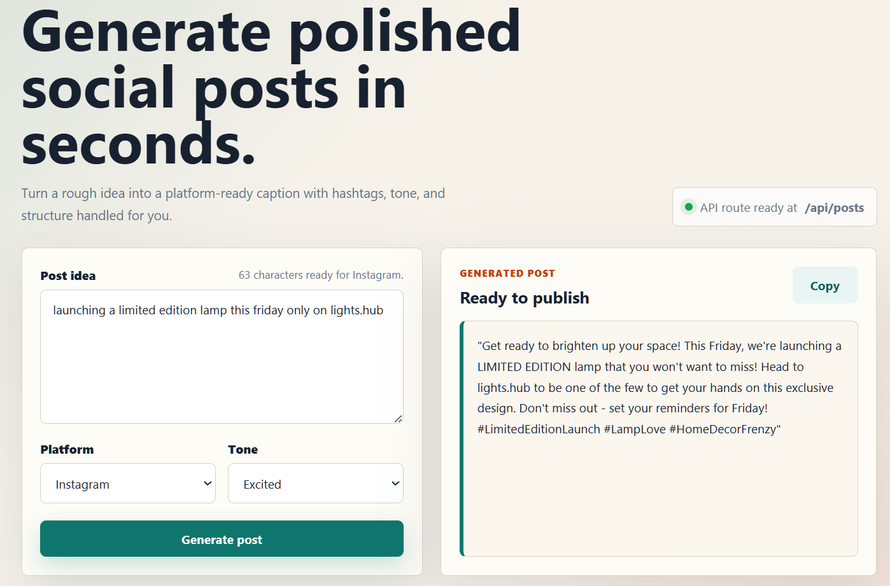
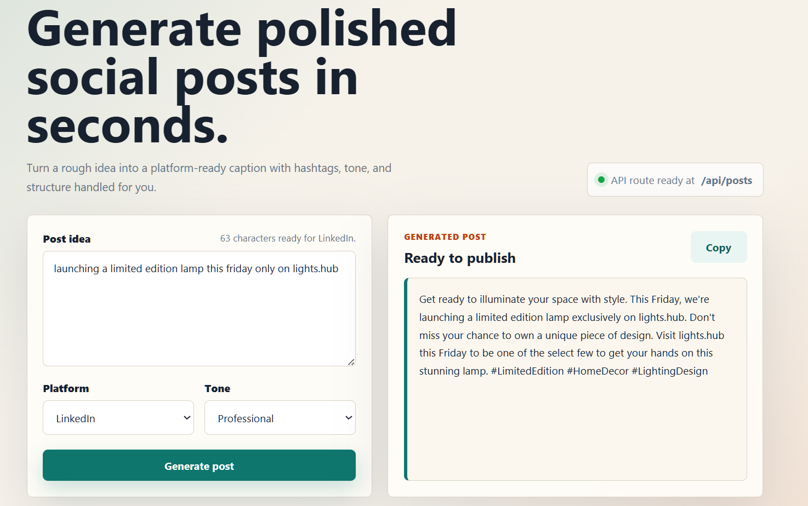
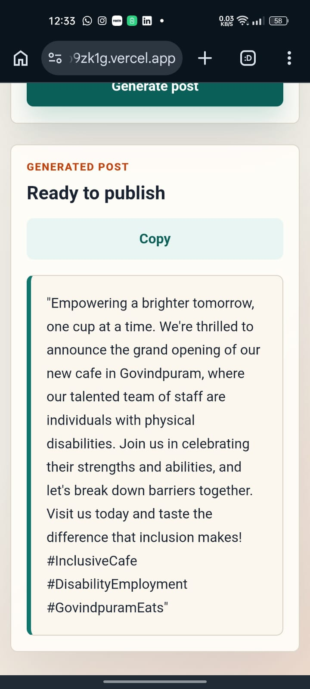

# AI Social Media Post Generator

Create engaging social media captions instantly using AI.

This project is a modern AI-powered caption generator built with Next.js and the Groq API. Users can enter a topic, choose a platform and tone, and generate ready-to-post content with relevant hashtags in seconds.

Designed with simplicity and speed in mind, the app focuses on creating a clean user experience while exploring practical real-world applications of Generative AI.

---

## Live Demo

[View Live Project](https://social-media-caption-generator-lcxb9zk1g.vercel.app/)

---

## Preview

### Home Interface



### Generated Caption



### Mobile Responsive View



## Features

- AI-generated social media captions
- Platform-specific content generation
- Multiple writing tones
- Smart hashtag generation
- One-click copy support
- Responsive modern UI
- Secure server-side API integration
- Fast AI responses powered by Groq

---

## Supported Platforms

- Instagram
- LinkedIn
- Facebook
- TikTok
- X (Twitter)

---

## Available Tones

- Professional
- Casual
- Funny
- Inspirational
- Excited

---

## Tech Stack

- Next.js 14
- React 18
- TypeScript
- Tailwind CSS
- Groq API

---

## Why I Built This

I wanted to build a lightweight AI tool that solves a simple but common problem: creating engaging captions for different social media platforms quickly.

The project also helped me explore:

- Generative AI workflows
- API integration
- Prompt engineering
- Full-stack development with Next.js
- Clean and responsive frontend design

---

## How It Works

```text
User Input
   |
Next.js API Route
   |
Groq API
   |
AI Generated Caption
   |
Frontend Display
```

---

## Local Setup

Clone the repository:

```bash
git clone https://github.com/zaid1234-11/genAI.git
```

Install dependencies:

```bash
npm install
```

Create a `.env.local` file:

```env
GROQ_API_KEY=your_groq_api_key
GROQ_MODEL=llama-3.3-70b-versatile
```

Start the development server:

```bash
npm run dev
```

Open:

```bash
http://localhost:3000
```

---

## API Example

Request:

```json
{
  "topic": "Launching an eco-friendly sneaker brand",
  "platform": "Instagram",
  "tone": "Excited"
}
```

Response:

```json
{
  "success": true,
  "post": "Big things are stepping in..."
}
```

---

## Deployment

This project can be deployed easily using:

- Vercel
- Netlify

Environment variables required:

```env
GROQ_API_KEY
GROQ_MODEL
```

---

## Security

The API key is securely handled on the server side using Next.js API routes.

Avoid exposing keys publicly using:

```env
NEXT_PUBLIC_GROQ_API_KEY
```

Public environment variables are visible in the browser.

---

## Future Improvements

- AI image caption support
- Multi-language generation
- Saved caption history
- Export options
- Social media scheduling integration
- Custom prompt templates

---

## License

This project is licensed under the MIT License.
